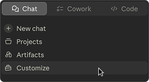

# JoomPulse Skills

Public agent skills for working with JoomPulse.

This repository is a catalog of reusable skills that help AI agents turn
JoomPulse product and market data into practical workflows for Mercado Livre
sellers and teams.

## Install

### Via link
1. Copy this repository's link from your browser.
2. Paste the link into Claude chat or Claude Cowork.
3. Tell Claude: "Download all skills from this repository." Claude will give you `.zip` files.
4. Import them in the **Customize** tab → **Skills** → **"+"** button → **Add new skill** → **Upload skill**, then choose the `.zip` files from your file manager.




### Via Claude terminal
If you have the Claude terminal installed, run these commands in it one at a time:

```bash
/plugin marketplace add joomcode/pulse-skills
/plugin install pulse-skills@joomcode
```

After installation, start a new session so the skill metadata is loaded.

## Connect the JoomPulse MCP (required)

To use these skills you first need to connect the **JoomPulse MCP** — it provides the live market data they run on, and without it the skills won't work.

> **Get access and details:** https://joompulse.com/mcp-connector

**1. Open Claude settings**
Launch the app or open **claude.ai** and go to **Settings → Connectors**.


**2. Add the custom connector**
Click **+ → Add custom connector**, name it **JoomPulse**, and paste the URL:
`https://joompulse.com/mcp`


**3. Connect and sign in**
Click **Add → Connect**, sign in with your JoomPulse account — you're ready to delegate tasks from chat.


## Skills

| Skill | What it does | Typical requests | Typical requests (pt-BR) |
| --- | --- | --- | --- |
| [`pulse-find-exact-same-product`](skills/pulse-find-exact-same-product/SKILL.md) | Finds product listings that appear to represent the same real-world product as a reference item. | "find the same product", "match this product", "find duplicate listings" | "encontrar o mesmo produto", "achar produto igual", "encontrar anúncios duplicados" |
| [`ml-product-analysis`](skills/ml-product-analysis/SKILL.md) | Analyzes one Mercado Livre product and its competitors, returning a product card and a ranked table of comparable products with price, estimated sales and revenue, logistics, and catalog / buy-box status. | "analyze this product", "how much does this sell", "find competing products" | "analisar este produto", "quanto vende esse produto", "encontrar produtos concorrentes" |
| [`product-change-monitor`](skills/product-change-monitor/SKILL.md) | Tracks how a Mercado Livre product changed over a period (by default week over week), returning a change table with the current price, rating, review count, estimated weekly sales and revenue, logistics, and seller details, each shown against about a week ago. | "monitor this product", "track price changes", "what changed this week", "did the price drop" | "monitorar este produto", "acompanhar este anúncio", "o preço caiu", "variação de avaliações" |
| [`uncontested-niche-finder`](skills/uncontested-niche-finder/SKILL.md) | Finds low-competition niche products in deep sub-categories that have no platinum sellers, ranked by estimated weekly sales and revenue. | "uncontested niche", "low-competition products", "categories without platinum sellers" | "nicho sem concorrência", "produtos sem vendedor platinum", "nicho pouco disputado" |
| [`growing-leaf-category-tracker`](skills/growing-leaf-category-tracker/SKILL.md) | Finds the fastest-growing deep sub-categories under a chosen category, ranked by month-over-month revenue growth. | "fast-growing subcategories", "which niches are growing", "deep growing categories" | "subcategorias em crescimento", "nichos que mais crescem", "categorias profundas em alta" |
| [`category-monitor`](skills/category-monitor/SKILL.md) | Builds a downloadable snapshot of a category's aggregate health (estimated sales, products, catalog products, sellers, medal mix, monopolization); when you supply a previous snapshot, it reports what changed between the two periods. | "monitor this category", "what changed in this category", "compare this category with last period", "track category sales and sellers" | "monitorar esta categoria", "o que mudou na categoria", "comparar a categoria com o período anterior", "variação de vendas e vendedores da categoria" |
| [`category-opportunity-index`](skills/category-opportunity-index/SKILL.md) | Reports a category's opportunity index plus its monthly market stats (estimated GMV, sales, sellers, listings, average ticket) with a plain-language read on how attractive it is. | "is this category worth entering", "opportunity index for this category", "how big is this market" | "qual o índice de oportunidade", "vale a pena entrar nessa categoria", "tamanho de mercado da categoria" |
| [`top-keywords-in-my-category`](skills/top-keywords-in-my-category/SKILL.md) | Lists a category's top trending Mercado Livre search keywords with each term's rank and how many products compete for it (real search-trend data). | "top keywords in my category", "trending search terms", "what do people search for" | "palavras-chave mais buscadas", "termos em alta na categoria", "o que as pessoas pesquisam" |
| [`top-sellers-in-category`](skills/top-sellers-in-category/SKILL.md) | Ranks the top sellers in a category by estimated average monthly revenue as a downloadable leaderboard, and tracks how the ranking moves when you supply a previous-period leaderboard. | "top sellers in this category", "rank sellers by revenue", "who moved up or down" | "principais vendedores da categoria", "ranking de vendedores por receita", "quem subiu ou caiu na categoria" |
| [`seller-overview-tracker`](skills/seller-overview-tracker/SKILL.md) | Builds today's snapshot table for one Mercado Livre seller (revenue, sales, listings, reputation, medal, cancellation rate) as a downloadable table; to see what changed, the user sends the seller's table from a previous period for a metric-by-metric comparison. | "track this seller", "monitor this store", "what changed for this seller" | "monitorar este vendedor", "acompanhar esta loja", "o que mudou nesse vendedor" |
| [`international-product-matcher`](skills/international-product-matcher/SKILL.md) | Finds fast-growing international products in a category and matches each to a JoomPro product, with a per-item import action. | "find international products and match them to JoomPro", "imported products I can source" | "produtos internacionais para importar na JoomPro", "achar internacionais e casar com a JoomPro" |
| [`fast-growing-international-products`](skills/fast-growing-international-products/SKILL.md) | Finds fast-growing international (imported) products across all categories as one table, each tagged with its category. | "fast-growing international products", "imported products taking off", "cross-border winners across all categories" | "produtos internacionais em alta", "produtos importados crescendo rápido", "internacionais que mais crescem em todas as categorias" |
| [`new-growing-products-in-category`](skills/new-growing-products-in-category/SKILL.md) | Finds new, already-selling listings in a category (recently listed, well rated, with estimated sales traction) as a product table. | "new products in category", "what's launching and already selling", "recent best-sellers" | "produtos novos na categoria", "novos anúncios que já vendem", "lançamentos em alta" |
| [`popular-international-products`](skills/popular-international-products/SKILL.md) | Finds fast-growing international (imported) products in one category, with a JoomPulse link per item and a JoomPro sourcing pointer. | "popular international products in this category", "fast-growing imported products", "trending imported items" | "produtos internacionais em alta nessa categoria", "produtos importados que mais crescem", "achados internacionais para importar" |
| [`high-demand-low-quality-finder`](skills/high-demand-low-quality-finder/SKILL.md) | Finds products in a category with high demand but a low rating — openings to enter with a better offer. | "high demand low rating products", "products I can beat", "low quality opportunities" | "produtos com muita demanda e nota baixa", "produtos mal avaliados que vendem", "onde entrar com oferta melhor" |
| [`top-brand-position-tracker`](skills/top-brand-position-tracker/SKILL.md) | Ranks the brands in a category by estimated weekly revenue (GMV) and tracks how each brand's position changes between periods when the user supplies a previous brand table. | "top brands in this category", "which brands are growing", "brand ranking" | "principais marcas da categoria", "ranking de marcas", "quais marcas estão crescendo" |
| [`my-product-vs-catalog`](skills/my-product-vs-catalog/SKILL.md) | Compares the seller's own Mercado Livre listing against the available competing listings of the same catalog product (the buy-box competition), scoring price, free shipping, Mercado Envios Full, listing type, seller reputation and medal, and official store (reviews and rating shown as context), and returning a verdict, a comparison table, and a prioritized action list. | "why don't I win the buy-box", "compare me to the catalog", "my position in the catalog" | "por que não ganho o buy-box", "por que não vendo se tenho o mesmo produto", "comparar meu anúncio com o catálogo" |
| [`unbranded-products-in-category`](skills/unbranded-products-in-category/SKILL.md) | Finds products with no brand (unbranded / no-name) in a category — an opening to enter with your own brand / private label — as a ranked product table. | "unbranded products", "products without a brand", "private-label opportunities" | "produtos sem marca", "genéricos que vendem", "oportunidade de marca própria" |

## How These Skills Work

Each skill is a Markdown file with YAML frontmatter. The frontmatter tells the
agent when the skill is relevant; the body provides the workflow to follow once
the skill is triggered.

Skills should describe public behavior and user-visible workflow. They must not
publish private service names, credentials, internal paths, private URLs, or
implementation details that are not intended for external use.

## Contributing

See [CONTRIBUTING.md](CONTRIBUTING.md).

## Security

See [SECURITY.md](SECURITY.md).
